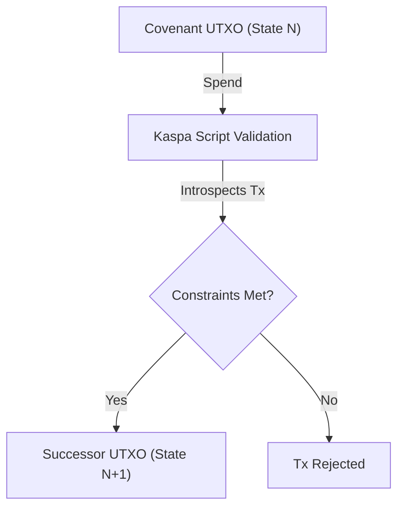

# The Covenant Model

> **L1 Status:** ACTIVE CONSENSUS | **SilverScript:** OFFICIAL RELEASE v1.0.0

Kaspa Covenants are not EVM smart contracts. There is no "contract account" that sits persistently at a fixed address holding state.

## What is a Kaspa Covenant?

A Covenant is a constraint placed on a UTXO. It dictates:
1. **How** the UTXO may be spent (e.g., requires a specific signature).
2. **What** successor outputs must be created when it is spent (e.g., "You can spend this coin, but you must create a new coin with this exact script and value").

Because the script can introspect the spending transaction (KIP-17), it enforces a strict state transition from one UTXO to the next.

## The State Transition Lifecycle

* **Where execution occurs:** On every Kaspa node on the network.
* **When validation occurs:** During the UTXO spend validation phase.
* **What state means:** The current data encoded in the UTXO's script or output.
* **What persists:** The successor UTXO.

## P2SH and State Evolution

Covenants often use **Pay-to-Script-Hash (P2SH)**. Because a covenant's state is often encoded directly into its script, **when the state changes, the script changes, and therefore the P2SH address changes.**

You cannot assume a covenant will live at a stable Kaspa address forever. Tracking a covenant by its address will fail as soon as its state evolves. This is precisely why **Covenant IDs** were introduced.

## Security Model

A covenant is only as secure as its script constraints.
* **Incorrect Successor Constraints:** If the script fails to enforce that the successor UTXO maintains the covenant, the funds can be stolen or "broken out" of the covenant.
* **Compiler Trust:** If you use SilverScript to write your covenant, you must trust that the compiler correctly translates your logic into secure Kaspa Script constraints.
* **Not "Trustless":** While consensus execution is trustless, the application logic itself may contain bugs.

