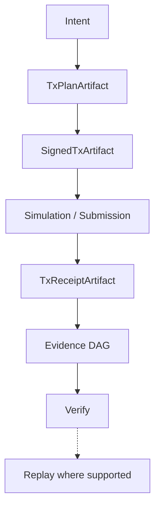

import QualificationContext from '@site/src/components/QualificationContext';

The transaction lifecycle in HardKAS transforms a high-level intent into a strict, verifiable cryptographic lineage. Rather than mutating state immediately via RPC, HardKAS explicitly materializes each stage of the lifecycle as a verifiable artifact.

---

## 1. Intent (Input)

- **Input:** A developer's high-level command (e.g., "send 50 KAS", "deploy contract").
- **Owner:** Developer / Application logic.
- **Operation:** Translating raw intent into a query against the active execution environment. HardKAS fetches required UTXOs, evaluates maturity, and calculates fees.
- **Failure Boundary:** Fails if funds are insufficient, UTXOs are immature, or the execution target is unreachable.

## 2. Planning (`TxPlanArtifact`)

- **Input:** Evaluated state from the Intent phase.
- **Owner:** HardKAS Core Planner (`TxPlanService`).
- **Operation:** Deterministically constructs the exact transaction graph without signatures.
- **Output:** `TxPlanArtifact`
- **Persisted Evidence:** The plan is written to the local artifact store, assigned a canonical `artifactId` and `contentHash`.
- **Environment Differences:** A plan generated for `localnet` will explicitly embed `"mode": "localnet"` in its `ExecutionTarget` and cannot be accidentally reused on `mainnet`.

## 3. Signing (`SignedTxArtifact`)

- **Input:** `TxPlanArtifact`.
- **Owner:** Wallet Adapter / Signer.
- **Operation:** The signer approves the plan and injects cryptographic signatures for the inputs.
- **Output:** `SignedTxArtifact`.
- **Persisted Evidence:** Cryptographically links back to the plan via `parentArtifactId: <plan-artifact-id>`.
- **Failure Boundary:** Fails if the plan was maliciously mutated before signing (content hash mismatch) or if the signer rejects the operation policy.

## 4. Simulation / Submission

- **Input:** `SignedTxArtifact`.
- **Owner:** HardKAS Execution Guard.
- **Operation:** The guard validates the `ExecutionTarget`. If the target is the simulator, it executes the transaction against local synthetic state. If the target is RPC, it broadcasts the payload to the node network.
- **Failure Boundary:** Fails if the execution environment rejects the payload (e.g., orphan transaction, double spend attempt against live mempool, or environment mismatch).

## 5. Receipt (`TxReceiptArtifact`)

- **Input:** Network or Simulator acknowledgment.
- **Owner:** HardKAS Execution Guard.
- **Operation:** Captures the node's acknowledgment that the transaction was accepted into its mempool (or simulator state). A receipt proves submission acceptance, not consensus finality or mining confirmation.
- **Output:** `TxReceiptArtifact` (contains the canonical `txId` as recognized by the Kaspa network).
- **Persisted Evidence:** Links back to the `SignedTxArtifact`, cementing the end of the transaction pipeline.

## 6. Persistence & Evidence DAG

- **Owner:** Artifact Engine.
- **Operation:** HardKAS verifies the cryptographic chain `TxPlanArtifact -> SignedTxArtifact -> TxReceiptArtifact`. All metadata, inputs, and environment configurations are durably recorded in the `.hardkas/` workspace.

## 7. Verify & Replay

- **Operation:** Using the Evidence DAG, HardKAS can verify the exact sequence of events that led to a mutation. If the environment supports it (e.g., Simulator), the entire transaction can be replayed deterministically to prove execution logic.

<QualificationContext capabilityId="artifacts" />
