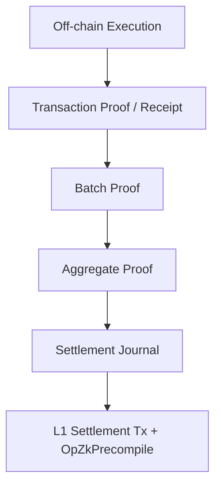

# The ZK Proving Pipeline

> **vProgs Status:** ACTIVE DEVELOPMENT / PROTOTYPE | **Underlying Toccata Primitives:** ACTIVE CONSENSUS

The `zk` module in the vProgs repository defines a multi-stage proving pipeline. Generating a ZK proof for every single transaction directly on L1 would be prohibitively expensive; therefore, vProgs relies on batching and aggregation.

## Pipeline Stages

1. **Transaction Proof:** A proof (e.g., via RISC Zero) that a single application transaction executed correctly, mutating the state from `root_pre` to `root_post`.
2. **Batch Proof:** Combines multiple transaction proofs within a lane into a single proof that validates the entire sequence.
3. **Aggregate Proof:** Recursively aggregates multiple batch proofs into a final, highly compressed validity proof.
4. **Settlement Journal:** The public inputs (ABI) output by the final proof, which the L1 settlement transaction binds to.

## Proof Statement Identity (Cache Vulnerabilities)

> **Canonical Security Question:** A valid proof of *exactly which statement*?

A ZK Proof guarantees that a computation was executed correctly. It does not inherently guarantee that the computation was relevant to your specific application or state. 

The **Proof Statement Identity** is the exact combination of variables (image IDs, covenant IDs, lane keys, sequencing commitments, state roots) that binds a proof to the correct context. 

*Development Risk:* The upstream vProgs repository currently has open development issues regarding proof receipt caching and statement binding (e.g., cache keys not committing to all necessary context variables). These are being actively resolved in the prototype phase, but they highlight why committing ZK proving code does not equal production readiness.

## Asynchronous Latency

Proof generation is computationally heavy and asynchronous.
* User application execution may advance in the `transaction-runtime` immediately.
* The ZK proof generation happens in the background.
* L1 settlement happens only after aggregation completes.

This means the application operates with pending settlements. If an L1 reorg occurs before the settlement is confirmed, the vProgs node must handle rollbacks of its pending execution state.
