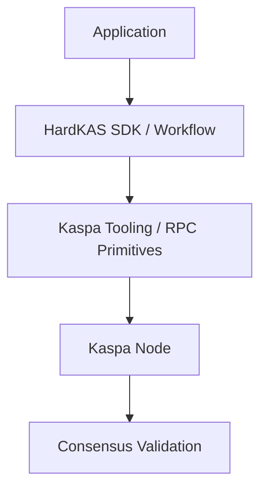

## The Problem

Developing on blockchain natively often means throwing transactions into the network and hoping they confirm as expected. If they fail, debugging relies on interpreting node logs or searching blockchain explorers. This "request -> mutation -> hope" cycle lacks the deterministic rigor needed for building robust backend services, checkout systems, and wallets. 

## What HardKAS Is

HardKAS is a deterministic, local-first developer operating system and framework for building Kaspa applications. It replaces the traditional "request-and-hope" cycle with a reproducible workflow: **intent -> artifact -> verify -> execute -> replay**.

It provides developers with:
- A strictly typed **SDK** for transaction composition and state queries.
- A comprehensive **CLI** for workflow orchestration, inspection, and local node management.
- An **Artifact Engine** that tracks the provenance and lifecycle of every operation.
- **Local execution environments** including deterministic simulation and real-node sandboxes.
- **RPC Diagnostics** and testing tooling.

HardKAS operates strictly within the **Golden Core Qualification Model**, emphasizing evidence generation, reproducible workflows, and verifiable state boundaries.

## What HardKAS is NOT

- **Not a Kaspa Node:** HardKAS orchestrates and queries Kaspa nodes (like `rusty-kaspa`), but it does not implement consensus.
- **Not a Trustless Bridge:** It provides simulation tools for L1/L2 interactions, not production bridging.
- **Not Production Custody Software:** HardKAS is developer infrastructure. While it enforces strict safety orchestrations during development (e.g., path traversal sandboxing, maturity filtering, pending-spend protection), it is not a replacement for a secure production custody solution or HSM.

## Relationship with Kaspa Protocol

HardKAS is strictly a **workflow layer** built on top of Kaspa's RPC and UTXO structures.
- **Safety Orchestration ? Consensus:** HardKAS protects the developer workflow (e.g. preventing double-spending in a plan or validating fees locally). However, the Kaspa node's consensus engine is the ultimate arbiter of transaction validity.
- HardKAS provides the tools to build, simulate, and provide evidence for a transaction before submitting it to the Kaspa protocol.

### System Boundary

## Infrastructure vs Custody

HardKAS treats signing and execution as separate, bounded operations. It provides the **infrastructure** to construct transaction intents (`TxPlan`), track their provenance, and safely submit them. However, it explicitly delegates the ultimate responsibility of key management and custody to the developer's integration (e.g., a wallet provider, CLI signer, or offline process).
