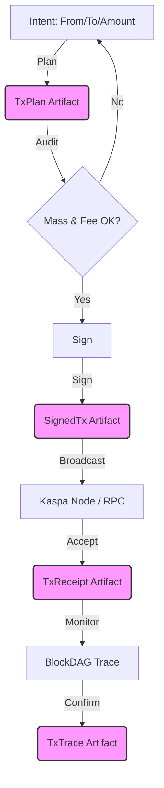

# Transaction Lifecycle

The HardKAS transaction lifecycle is a deterministic pipeline that transforms a developer's intent into a verified BlockDAG state.

## Overview Diagram

## Lifecycle Phases

### 1. Planning (`plan`)
- **Inputs**: Sender, Recipient, Amount, Fee Rate, Network.
- **Process**:
    - Fetch UTXOs from RPC or Localnet.
    - Run `TxBuilder` to select coins and calculate change.
    - Estimate `Mass` and `Fee`.
- **Output**: `hardkas.txPlan.v2` artifact.

### 2. Audit & Verification (`verify`)
- **Inputs**: `TxPlan` artifact.
- **Process**:
    - **Integrity**: Validate `contentHash`.
    - **Semantic**: Check for dust outputs, negative fees, or invalid addresses.
    - **Economic**: Verify that `Fee >= Mass * FeeRate`.
- **Decision**: Proceed to signing only if audit passes.

### 3. Signing (`sign`)
- **Inputs**: `TxPlan` artifact + Account (Keystore/Simulated).
- **Process**:
    - Produce signatures for selected UTXOs.
    - Construct the raw transaction payload.
- **Output**: `hardkas.signedTx.v2` artifact.

### 4. Broadcast (`send`)
- **Inputs**: `SignedTx` artifact.
- **Process**:
    - Extract raw payload.
    - Submit to Kaspa RPC via `submitTransaction`.
- **Output**: `hardkas.txReceipt.v2` artifact (initial status: `accepted`).

### 5. Confirmation & Tracing (`trace`)
- **Inputs**: `TxReceipt` artifact.
- **Process**:
    - Monitor RPC for transaction inclusion.
    - Capture `daaScore`, `blueScore`, and `dagContext`.
- **Output**: `hardkas.txTrace.v2` artifact.

## The Role of Lineage

Each stage in the lifecycle is linked via **Lineage Metadata**. A `SignedTx` artifact contains the `artifactId` of its parent `TxPlan`. This creates a verifiable audit trail from the initial intent to the final on-chain confirmation.
