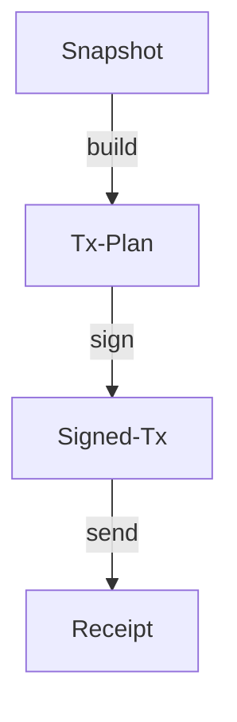

# HardKAS Artifact Model

The HardKAS Artifact Model is the core data layer for deterministic Kaspa operations. It transforms raw JSON files into a verifiable, linked operational history.

## 1. The Lineage Chain

HardKAS operations follow a structured lifecycle, where each step produces an artifact that points to its parent.



### Core Identity Fields
- **artifactId**: A unique identifier for the artifact (often matching the `contentHash`).
- **lineageId**: A stable UUID representing the entire operational flow.
- **rootArtifactId**: The ID of the initial artifact (usually the Snapshot) that started the flow.
- **parentArtifactId**: The ID of the immediate predecessor.

## 2. Deterministic Integrity

### Canonical Hashing
Every artifact is serialized using a **Canonical JSON Stringify** algorithm before hashing.
- Object keys are sorted alphabetically.
- Circular identity fields (`artifactId`, `contentHash`) are excluded during hashing.
- This ensures that two developers producing the same operational state will generate identical hashes.

### Semantic Verification
Beyond structural integrity, HardKAS performs **Semantic Audits**:
- **Economic Invariants**: Total Inputs >= Total Outputs + Fee.
- **Mass Recomputation**: Re-calculating transaction mass to ensure fee compliance.
- **Network Alignment**: Ensuring a `testnet` plan isn't being signed by a `mainnet` key.

## 3. Artifact Types

| Type | Schema | Purpose |
| :--- | :--- | :--- |
| **Snapshot** | `hardkas.snapshot.v2` | Captures DAA score, account balances, and UTXO sets. |
| **Tx-Plan** | `hardkas.txPlan.v2` | A non-signed proposal for a transaction, including UTXO selection. |
| **Signed-Tx** | `hardkas.signedTx.v2` | A fully signed transaction ready for broadcast. |
| **Receipt** | `hardkas.txReceipt.v2` | Proof of submission and confirmation on the blockDAG. |

## 4. Operational Invariants

### Replay Protection
Lineage IDs and sequences prevent the accidental reuse of old transaction plans.

### Mode Isolation
Artifacts are explicitly marked as `simulated` or `real`. The system strictly prohibits "Mode Contamination"—mixing simulated state with real network operations.

## 5. Audit Workflow
Use the CLI to introspect any artifact:
```bash
hardkas artifact explain <file>
```
This command performs a deep dive into the artifact's identity, economics, and security status.
