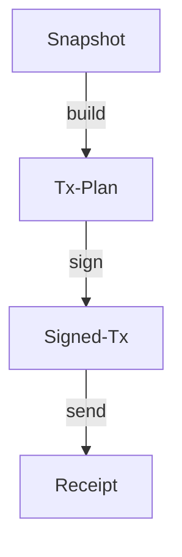

# HardKAS Artifact Model

The HardKAS Artifact Model is the core data layer for deterministic Kaspa operations. It transforms raw JSON files into a verifiable, linked operational history.

## 1. The Artifact Trust Boundary

Artifact verification in HardKAS is designed to prove **internal consistency** and **provenance**, but it does not replace network-level consensus.

### What Verification Proves:
- **Integrity**: The bytes are intact and the `contentHash` matches the semantic data.
- **Identity**: The artifact represents a specific state and schema version.
- **Lineage**: The artifact belongs to a valid chain of operations (e.g., this Receipt came from that SignedTx).
- **Contamination**: No mixing of networks (Mainnet/Testnet) or modes (Real/Simulated) has occurred.

### What Verification Does NOT Prove:
- **Consensus Validity**: Does not prove the transaction is valid under Kaspa consensus rules (unless Replay is verified).
- **Finality**: Does not prove the transaction has reached sufficient confirmation depth.
- **Network State**: Does not prove that the referenced UTXOs are still unspent on the live network.

## 2. Deterministic Identity

### Canonical Hashing
HardKAS uses a deterministic serialization algorithm (`canonicalStringify`) to ensure that hashes are stable across different platforms (Node.js versions, OS, CI).

#### Rules:
- **Recursive Sorting**: All object keys are sorted alphabetically.
- **BigInt Handling**: BigInts are serialized as **JSON strings** (e.g., `"100"`) to preserve precision and distinguish them from Number types.
- **Exclusion List**: Non-semantic metadata is excluded from the hash:
  - `contentHash`, `artifactId` (The result of hashing).
  - `lineage` block (Provenance metadata).
  - `createdAt`, `rpcUrl`, `hardkasVersion`, `file_path`.
- **Semantic Inclusion**: The `version` field (schema version) **is included** in the hash. A change in artifact schema version is a semantic identity change.

### Hash Evolution
The `contentHash` semantics are tied to the `hashVersion` field. If the canonicalization rules evolve, the `hashVersion` will be incremented to prevent silent hash collisions or mismatches with historical artifacts.

## 3. The Lineage Chain

HardKAS operations follow a structured lifecycle, where each step produces an artifact that points to its parent.



### Lineage Invariants
- **Consistency**: `lineageId` and `rootArtifactId` must remain constant across the entire flow.
- **Continuity**: `parentArtifactId` must match the `artifactId` of the previous step.
- **Monotonicity**: The `sequence` number should ideally increase with each step (warnings are issued for non-monotonic jumps in branches/merges).
- **Isolation**: Network and Mode must match between parent and child.

## 4. Semantic Verification

Beyond structural integrity, HardKAS performs **Semantic Audits**:
- **Economic Invariants**: Total Inputs >= Total Outputs + Fee.
- **Mass Recomputation**: Re-calculating transaction mass to ensure fee compliance.
- **Network Alignment**: Ensuring a `testnet` plan isn't being signed by a `mainnet` key.

## 5. Audit Workflow

Use the CLI to introspect any artifact:
```bash
hardkas artifact verify <file> --strict
hardkas artifact explain <file>
```
These commands perform a deep dive into the artifact's identity, economics, and security status.
