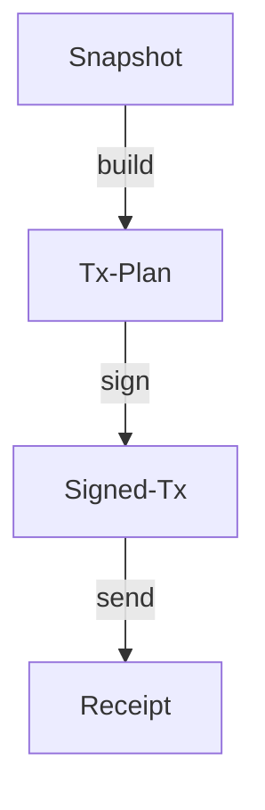

# HardKAS Artifact Model

The HardKAS Artifact Model is the core data layer for deterministic Kaspa operations. It transforms raw JSON files into a verifiable, linked operational history.

## 1. The Artifact Trust Boundary

Artifact verification in HardKAS is designed to prove **internal consistency** and **provenance**, but it does not replace network-level consensus.

### What Verification Proves:
- **Integrity**: The bytes are intact and the `contentHash` matches the semantic data.
- **Identity**: The artifact represents a specific state and schema version.
- **Lineage**: The artifact belongs to a valid chain of operations (e.g., this Receipt came from that SignedTx).
- **Contamination**: No mixing of networks (Mainnet/Testnet) or modes (Real/Simulated) has occurred.

### What Verification Does NOT Prove:
- **Consensus Validity**: Does not prove the transaction is valid under Kaspa consensus rules (unless Replay is verified).
- **Finality**: Does not prove the transaction has reached sufficient confirmation depth.
- **Network State**: Does not prove that the referenced UTXOs are still unspent on the live network.

## 2. Deterministic Identity

### Canonical Hashing (v3)
HardKAS uses a deterministic serialization algorithm (`canonicalStringify`) to ensure that hashes are stable across all platforms (Windows, Linux, macOS) and environments (CI, local, docker).

#### Rules:
- **Recursive Sorting**: All object keys are sorted alphabetically.
- **Unicode Normalization (NFC)**: All strings are normalized to **NFC** (Normalization Form Canonical Composition) before hashing. This ensures that characters like `é` (U+00E9) are treated identically regardless of whether the OS uses decomposed or composed forms.
- **Line-Ending Normalization (LF)**: All strings containing newlines are normalized to use **LF** (`\n`). This prevents hash divergence between Windows (`\r\n`) and Unix (`\n`) environments.
- **BigInt Type-Safety**: BigInts are serialized with a distinct marker or as strings (depending on `hashVersion`) to preserve precision and distinguish them from Number types.
- **Exclusion List**: Non-semantic metadata is excluded from the hash:
  - `contentHash`, `artifactId`, `signature` (Results of hashing/signing).
  - `lineage` block (Provenance metadata).
  - `createdAt`, `rpcUrl`, `hardkasVersion`, `file_path`, `networkId` (When acting as ambient context).
- **Semantic Inclusion**: The `version` (schema) and `hashVersion` (algorithm) are included to ensure identity stability.

### Hash Evolution
- **v1**: Basic sorting, no BigInt type markers.
- **v2**: BigInt type markers, primitive sorting.
- **v3 (Current)**: **NFC Normalization** + **Newline Normalization**. This is the standard for **HARDENED ALPHA** cross-platform reproducibility.

## 3. The Lineage Chain

HardKAS operations follow a structured lifecycle, where each step produces an artifact that points to its parent.



### Lineage Invariants
- **Consistency**: `lineageId` and `rootArtifactId` must remain constant across the entire flow.
- **Continuity**: `parentArtifactId` must match the `artifactId` of the previous step.
- **Monotonicity**: The `sequence` number must strictly increase.
- **Isolation**: Network and Mode must match between parent and child.
- **Adversarial Hardening**:
  - **No Cycles**: Lineage cannot form a directed cycle.
  - **No Cross-Network Parentage**: A `mainnet` artifact cannot have a `simnet` parent.
  - **Strict Hash-Linkage**: Hash mismatches in the parent link are treated as fatal corruption.

## 4. Semantic Verification

Beyond structural integrity, HardKAS performs **Semantic Audits**:
- **Economic Invariants**: Total Inputs >= Total Outputs + Fee.
- **Mass Recomputation**: Re-calculating transaction mass to ensure fee compliance.
- **Network Alignment**: Ensuring a `testnet` plan isn't being signed by a `mainnet` key.

## 5. Audit Workflow

Use the CLI to introspect any artifact:
```bash
hardkas artifact verify <file> --strict
hardkas artifact explain <file>
```
These commands perform a deep dive into the artifact's identity, economics, and security status.
