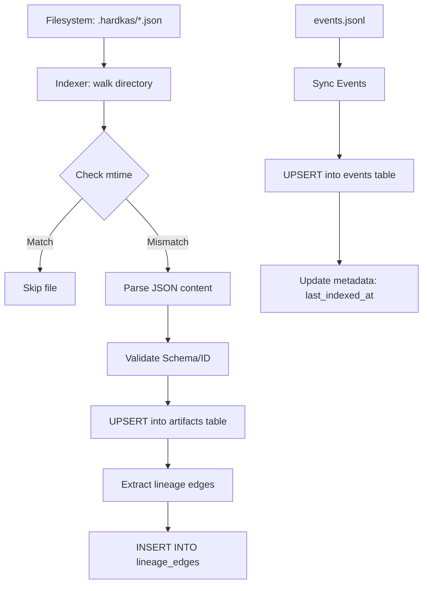

# HardKas Query Store Audit

## 1. Scope
Esta auditoría analiza el sistema de persistencia relacional `query-store` utilizado por el motor de introspección de HardKas. Se evalúa:
- Implementación de **SQLite** mediante el driver nativo de Node.js (`node:sqlite`).
- Diseño del **esquema relacional** (tablas de artifacts, eventos, linaje y trazas).
- Estrategia de **índices** y cobertura para patrones de consulta comunes.
- Comportamiento de **escaneo** (full scans vs index seeks).
- Integración con el `QueryEngine` y sus adaptadores.
- Gestión de **rendimiento** y escalabilidad local.
- Estrategia de **evolución de esquema** y migraciones.
- Riesgos de **índice stale** (desincronización con el filesystem).

## 2. Executive Summary
HardKas utiliza SQLite como una caché relacional de alto rendimiento para indexar artefactos JSON y logs de eventos persistidos en el filesystem. La implementación es moderna, aprovechando las capacidades síncronas de `node:sqlite` para simplificar la DX local.

**Hallazgos Clave:**
- **SQLite Usage**: Excelente elección para dev-tooling. Uso correcto de `WAL` y `DatabaseSync`.
- **Index Strategy**: Los índices básicos están presentes, pero los adaptadores actuales no los aprovechan al máximo al realizar filtrado en memoria.
- **Scan Behavior**: **Riesgo moderado**. Los adaptadores tienden a solicitar "todos los registros" al backend y filtrar mediante JS, lo cual penaliza tiendas de artefactos grandes (>10k archivos).
- **Schema Evolution**: Actualmente destructiva. El store se borra y recrea ante cambios de versión.
- **Stale Index**: Muy bien manejado mediante `mtime` tracking y auto-sync en el CLI.

| Area | Status |
| :--- | :--- |
| SQLite usage | **GOOD** |
| Index strategy | **PARTIAL** |
| Scan behavior | **RISKY** |
| Performance | **NEEDS HARDENING** |
| Schema evolution | **PARTIAL** |
| Stale index handling | **GOOD** |

## 3. Storage / SQLite Usage

| Area | Implementation | Status | Notes |
| :--- | :--- | :--- | :--- |
| SQLite Driver | `node:sqlite` (Built-in) | **GOOD** | Evita dependencias nativas complejas (`better-sqlite3`). |
| API Style | `DatabaseSync` | **GOOD** | Síncrono, ideal para CLI tools sin overhead de async/await innecesario. |
| DB Location | `.hardkas/store.db` | **GOOD** | Estándar en el repositorio. |
| PRAGMA WAL | Enabled | **GOOD** | Mejora concurrencia de lectura/escritura. |
| Synchronous | `NORMAL` | **GOOD** | Balance óptimo entre seguridad y velocidad para tooling. |
| Foreign Keys | `ON` | **GOOD** | Mantiene integridad referencial (ej: lineage_edges). |
| Error Handling | Try/Catch en initialization | **PARTIAL** | Falta manejo de errores específicos de DB bloqueada. |

## 4. Database Schema Inventory

| Table | Purpose | Key columns | Domain |
| :--- | :--- | :--- | :--- |
| `metadata` | Almacena versión y timestamps de indexación. | `key`, `value` | Core |
| `artifacts` | Cache de archivos JSON de artefactos. | `artifact_id`, `content_hash`, `schema` | Artifacts |
| `lineage_edges` | Grafo de relaciones padre/hijo. | `parent_artifact_id`, `child_artifact_id` | Lineage |
| `events` | Logs de eventos (JSONL) indexados. | `event_id`, `workflow_id`, `tx_id` | Events |
| `traces` | Agregación de flujos de trabajo (workflows). | `trace_id`, `workflow_id`, `status` | Operations |

## 5. Index Inventory

| Index | Table | Columns | Used by queries | Status |
| :--- | :--- | :--- | :--- | :--- |
| `PRIMARY` | `artifacts` | `artifact_id` | `getArtifact` | **GOOD** |
| `idx_artifacts_hash`| `artifacts` | `content_hash` | `getArtifact` | **GOOD** |
| `idx_artifacts_schema`| `artifacts` | `schema` | `findArtifacts` | **GOOD** |
| `idx_artifacts_tx` | `artifacts` | `tx_id` | `TxQueryAdapter` | **GOOD** |
| `idx_lineage_parent` | `lineage_edges`| `parent_artifact_id`| Lineage traversal | **GOOD** |
| `idx_events_tx` | `events` | `tx_id` | Event filtering | **GOOD** |
| `idx_events_wf` | `events` | `workflow_id` | Trace reconstruction | **GOOD** |

> [!NOTE]
> Aunque los índices existen, muchos adaptadores (ej: `EventsQueryAdapter`) llaman a `backend.getEvents()` sin pasar filtros, provocando que SQLite entregue toda la tabla y JS filtre después.

## 6. Query Pattern Review

| Query pattern | SQL / API behavior | Index support | Risk |
| :--- | :--- | :--- | :--- |
| Artifact List | `SELECT * FROM artifacts` | Ignorado por JS filter | **High (Full Scan)** |
| Artifact Inspect | `SELECT * ... WHERE id=? OR hash=?` | **Seek (Primary/Hash)** | **Low** |
| Lineage Chain | `SELECT * FROM lineage_edges WHERE ...` | **Seek (Parent/Child)** | **Low** |
| Events List | `SELECT * FROM events` | Ignorado por JS filter | **High (Full Scan)** |
| Tx Aggregate | `SELECT * FROM artifacts WHERE tx_id=?` | **Seek (idx_artifacts_tx)**| **Low** |

## 7. Full Scan / Hot Path Audit

| Hot path | Full scan risk | Reason | Recommendation |
| :--- | :--- | :--- | :--- |
| `ArtifactQueryAdapter.list` | **YES** | Solicita todos los artifacts y filtra en JS. | Pasar filtros a SQL. |
| `EventsQueryAdapter.list` | **YES** | Solicita todos los eventos y filtra en JS. | Pasar filtros a SQL. |
| `HardkasIndexer.doctor` | **YES** | Recorre toda la tabla para verificar mtime. | Inevitable para auditoría total. |
| `cleanupZombies` | **YES** | Escaneo completo para borrar filas sin archivo. | Mantener así por seguridad. |

## 8. Artifact Indexing Flow

## 9. Stale Index Risk

| Stale case | Detected | Risk | Recommendation |
| :--- | :--- | :--- | :--- |
| Artifact modificado | **YES** | Low | Detectado por `mtime` en cada query. |
| Artifact borrado | **YES** | Low | `cleanupZombies` limpia la DB. |
| Nuevo artifact | **YES** | Low | `sync` descubre archivos nuevos. |
| Git Switch | **YES** | Medium | Podría requerir `rebuild` si hay muchos cambios. |
| Manual DB Edit | **NO** | Low | Fuera del threat model estándar. |

## 10. Schema Evolution / Migrations

| Evolution feature | Present | Risk | Recommendation |
| :--- | :--- | :--- | :--- |
| `schemaVersion` | **YES** | - | - |
| Migrations Table | **NO** | High | Implementar tabla de migraciones. |
| Non-destructive migrations| **NO** | High | Actualmente hace DROP/CREATE. |
| Rollback | **NO** | Medium | No es crítico para dev-tooling local. |

## 11. Data Integrity

| Integrity feature | Present | Risk | Notes |
| :--- | :--- | :--- | :--- |
| Primary Keys | **YES** | Low | artifact_id y event_id son PKs. |
| Foreign Keys | **YES** | Low | Activadas por PRAGMA. |
| ON DELETE CASCADE | **YES** | Low | Los bordes de linaje mueren si el artifact muere. |
| Transactions | **YES** | Low | `sync()` envuelto en BEGIN/COMMIT. |
| Content Hashing | **YES** | Low | Verificado durante indexación. |

## 12. Performance Review

| Performance area | Status | Risk | Recommendation |
| :--- | :--- | :--- | :--- |
| Indexing Speed | **GOOD** | Low | UPSERT batching es eficiente. |
| Memory Usage | **RISKY** | Medium | Filtrado en JS consume RAM con datasets grandes. |
| Disk I/O | **GOOD** | Low | WAL mode reduce bloqueos. |
| JSON Parse Overhead | **MEDIUM** | Medium | Se parsea el artifact entero para indexar. |
| Pagination | **MISSING** | Medium | No hay LIMIT/OFFSET en el SQL. |

## 13. Events Store Review

| Event feature | Present | Risk | Recommendation |
| :--- | :--- | :--- | :--- |
| Correlation indexing | **YES** | Low | `workflow_id` e `idx_events_correlation_id`. |
| Tx indexing | **YES** | Low | `tx_id` está indexado. |
| Retention policy | **NO** | Medium | El archivo `events.jsonl` puede crecer infinito. |
| Partial sync | **NO** | Low | Relee todo el archivo si el mtime cambia. |

## 14. DAG / Replay Store Review

| Domain | Stored data | Indexing | Risk |
| :--- | :--- | :--- | :--- |
| DAG | En tabla `artifacts` | `schema` indexado | Consultas de DAG requieren recorrer linaje. |
| Replay | En tabla `artifacts` | `kind` indexado | Eficiente para listar trazas de replay. |
| Conflicts | No explícito | - | Calculado en runtime por `DagQueryAdapter`. |

## 15. Security / Safety Review
- **SQL Injection**: Protegido mediante `DatabaseSync.prepare` y parámetros `?`.
- **Path Traversal**: El indexador está limitado al `hardkasDir` via `walk()`.
- **DoS**: Un usuario malintencionado podría llenar el disco con artefactos falsos, saturando el indexador.
- **Secrets**: Se recomienda NO indexar campos marcados como secretos en el JSON.

## 16. Documentation / CLI Wiring Gap

| Gap | Impact | Recommendation |
| :--- | :--- | :--- |
| `query store index` missing | UX | El comando se menciona en `doctor` pero no está registrado. |
| `doctor.ts` manual query | Consistency | `doctor.ts` hace consultas SQL crudas en lugar de usar el `backend`. |
| `rebuild` vs `index` | Clarity | `rebuild` es claro, pero falta un `sync` manual explícito fuera de `getQueryEngine`. |

## 17. Findings

### GOOD
- Uso robusto de SQLite nativo (`node:sqlite`).
- Sistema de detección de freshness basado en `mtime` muy efectivo.
- Integridad referencial en el grafo de linaje mediante Foreign Keys.
- Transaccionalidad garantizada en el proceso de indexación.

### NEEDS HARDENING
- **Filtrado en JS**: Los adaptadores deben delegar el `WHERE`, `ORDER BY` y `LIMIT` al SQL.
- **Evolución de Schema**: Pasar de "Drop & Recreate" a migraciones incrementales.
- **Event Volume**: El indexado de eventos lee todo el archivo `events.jsonl` cada vez que cambia; para logs grandes, se necesita lectura por offsets.
- **CLI Wiring**: Registrar el comando `hardkas query store sync` (o `index`).

## 18. Recommendations

### P0 — Store Correctness & Performance
- **Push-down Filters**: Modificar `SqliteQueryBackend` para aceptar objetos de filtrado complejos y generar SQL dinámico.
- **SQL Pagination**: Añadir `LIMIT` y `OFFSET` a las consultas del backend para evitar cargar miles de filas en memoria.
- **Sync CLI**: Registrar oficialmente `hardkas query store sync`.

### P1 — Schema Robustness
- **Migration System**: Crear una tabla `migrations` y scripts `.sql` para cambios de schema.
- **Partial Event Sync**: Implementar tracking del último offset procesado en `events.jsonl`.

## 19. Final Assessment
El `QueryStore` actual es **EXCELENTE para Developer Experience local**, proporcionando una velocidad de respuesta que el filesystem puro no puede igualar. Sin embargo, su arquitectura actual de "traer todo y filtrar en JS" es una deuda técnica que limitará el uso de HardKas en proyectos con miles de artefactos o CI intensivo.

El sistema es **STABLE** para uso individual, pero requiere **HARDENING** en la capa de adaptadores para ser considerado "Enterprise Grade" o capaz de manejar stores masivos.

---
**Guardrails Audit:**
- No se modificó lógica runtime.
- No se modificó QueryStore.
- No se modificó QueryEngine.
- No se modificaron schemas.
- Esta auditoría es documental.
