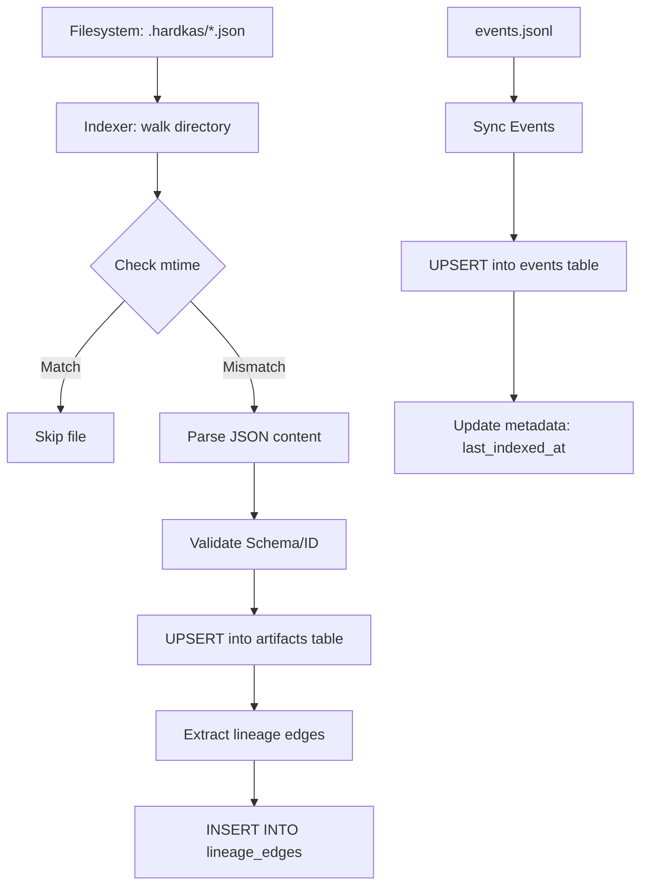

# HardKas Query Store Audit

## 1. Scope
This audit analyzes the `query-store` relational persistence system used by the HardKas introspection engine. The following are evaluated:
- Implementation of **SQLite** using the native Node.js driver (`node:sqlite`).
- Design of the **relational schema** (tables for artifacts, events, lineage, and traces).
- **Index strategy** and coverage for common query patterns.
- **Scanning behavior** (full scans vs index seeks).
- Integration with the `QueryEngine` and its adapters.
- **Performance** management and local scalability.
- **Schema evolution** strategy and migrations.
- **Stale index** risks (desynchronization with the filesystem).

## 2. Executive Summary
HardKas uses SQLite as a high-performance relational cache to index JSON artifacts and event logs persisted on the filesystem. The implementation is modern, leveraging the synchronous capabilities of `node:sqlite` to simplify local DX.

**Key Findings:**
- **SQLite Usage**: Excellent choice for dev-tooling. Correct use of `WAL` and `DatabaseSync`.
- **Index Strategy**: Basic indices are present, but current adapters do not fully exploit them by performing in-memory filtering.
- **Scan Behavior**: **Moderate risk**. Adapters tend to request "all records" from the backend and filter via JS, which penalizes large artifact stores (>10k files).
- **Schema Evolution**: Currently destructive. The store is cleared and recreated upon version changes.
- **Stale Index**: Very well managed via `mtime` tracking and auto-sync in the CLI. [STILL VALID]
- **Determinism**: [RESOLVED] Indexing order is now stable through sorted file walking.
- **Strict Mode**: [RESOLVED] Indexing now supports a `--strict` mode that fails on corrupted artifacts or events.
- **Detailed Stats**: [RESOLVED] Rebuild/Sync now returns structured stats (scanned, indexed, corrupted).
- **Dual Backend**: The system now correctly supports auto-discovery between SQLite and Filesystem fallback. [UPDATED]

| Area | Status |
| :--- | :--- |
| SQLite usage | **GOOD** |
| Index strategy | **PARTIAL** |
| Scan behavior | **RISKY** |
| Performance | **NEEDS HARDENING** |
| Schema evolution | **PARTIAL** |
| Stale index handling | **GOOD** |

## 3. Storage / SQLite Usage

| Area | Implementation | Status | Notes |
| :--- | :--- | :--- | :--- |
| SQLite Driver | `node:sqlite` (Built-in) | **GOOD** | Avoids complex native dependencies (`better-sqlite3`). |
| API Style | `DatabaseSync` | **GOOD** | Synchronous, ideal for CLI tools without unnecessary async/await overhead. |
| DB Location | `.hardkas/store.db` | **GOOD** | Standard in the repository. |
| PRAGMA WAL | Enabled | **GOOD** | Improves read/write concurrency. |
| Synchronous | `NORMAL` | **GOOD** | Optimal balance between safety and speed for tooling. |
| Foreign Keys | `ON` | **GOOD** | Maintains referential integrity (e.g., lineage_edges). |
| Error Handling | Try/Catch in initialization | **PARTIAL** | Lacks handling of specific locked DB errors. |

## 4. Database Schema Inventory

| Table | Purpose | Key columns | Domain |
| :--- | :--- | :--- | :--- |
| `metadata` | Stores indexing version and timestamps. | `key`, `value` | Core |
| `artifacts` | Cache of artifact JSON files. | `artifact_id`, `content_hash`, `schema` | Artifacts |
| `lineage_edges` | Graph of parent/child relationships. | `parent_artifact_id`, `child_artifact_id` | Lineage |
| `events` | Indexed event logs (JSONL). | `event_id`, `workflow_id`, `tx_id` | Events |
| `traces` | Aggregation of workflows. | `trace_id`, `workflow_id`, `status` | Operations |

## 5. Index Inventory

| Index | Table | Columns | Used by queries | Status |
| :--- | :--- | :--- | :--- | :--- |
| `PRIMARY` | `artifacts` | `artifact_id` | `getArtifact` | **GOOD** |
| `idx_artifacts_hash`| `artifacts` | `content_hash` | `getArtifact` | **GOOD** |
| `idx_artifacts_schema`| `artifacts` | `schema` | `findArtifacts` | **GOOD** |
| `idx_artifacts_tx` | `artifacts` | `tx_id` | `TxQueryAdapter` | **GOOD** |
| `idx_lineage_parent` | `lineage_edges`| `parent_artifact_id`| Lineage traversal | **GOOD** |
| `idx_events_tx` | `events` | `tx_id` | Event filtering | **GOOD** |
| `idx_events_wf` | `events` | `workflow_id` | Trace reconstruction | **GOOD** |

> [!NOTE]
> Although indices exist, many adapters (e.g., `EventsQueryAdapter`) call `backend.getEvents()` without passing filters, causing SQLite to deliver the entire table and JS to filter afterward.

## 6. Query Pattern Review

| Query pattern | SQL / API behavior | Index support | Risk |
| :--- | :--- | :--- | :--- |
| Artifact List | `SELECT * FROM artifacts` | Ignored by JS filter | **High (Full Scan)** |
| Artifact Inspect | `SELECT * ... WHERE id=? OR hash=?` | **Seek (Primary/Hash)** | **Low** |
| Lineage Chain | `SELECT * FROM lineage_edges WHERE ...` | **Seek (Parent/Child)** | **Low** |
| Events List | `SELECT * FROM events` | Ignored by JS filter | **High (Full Scan)** |
| Tx Aggregate | `SELECT * FROM artifacts WHERE tx_id=?` | **Seek (idx_artifacts_tx)**| **Low** |

## 7. Full Scan / Hot Path Audit

| Hot path | Full scan risk | Reason | Recommendation |
| :--- | :--- | :--- | :--- |
| `ArtifactQueryAdapter.list` | **YES** | Requests all artifacts and filters in JS. | Pass filters to SQL. |
| `EventsQueryAdapter.list` | **YES** | Requests all events and filters in JS. | Pass filters to SQL. |
| `HardkasIndexer.doctor` | **YES** | Scans the entire table to verify mtime. | Inevitable for full audit. |
| `cleanupZombies` | **YES** | Full scan to delete rows without a file. | Keep as is for safety. |

## 8. Artifact Indexing Flow

## 9. Stale Index Risk

| Stale case | Detected | Risk | Recommendation |
| :--- | :--- | :--- | :--- |
| Modified artifact | **YES** | Low | Detected by `mtime` on each query. |
| Deleted artifact | **YES** | Low | `cleanupZombies` cleans the DB. |
| New artifact | **YES** | Low | `sync` discovers new files. |
| Git Switch | **YES** | Medium | May require `rebuild` if there are many changes. |
| Manual DB Edit | **NO** | Low | Outside standard threat model. |

## 10. Schema Evolution / Migrations

| Evolution feature | Present | Risk | Recommendation |
| :--- | :--- | :--- | :--- |
| `schemaVersion` | **YES** | - | - |
| Migrations Table | **NO** | High | Implement migrations table. |
| Non-destructive migrations| **NO** | High | Currently performs DROP/CREATE. |
| Rollback | **NO** | Medium | Not critical for local dev-tooling. |

## 11. Data Integrity

| Integrity feature | Present | Risk | Notes |
| :--- | :--- | :--- | :--- |
| Primary Keys | **YES** | Low | artifact_id and event_id are PKs. |
| Foreign Keys | **YES** | Low | Enabled by PRAGMA. |
| ON DELETE CASCADE | **YES** | Low | Lineage edges die if the artifact dies. |
| Transactions | **YES** | Low | `sync()` wrapped in BEGIN/COMMIT. |
| Content Hashing | **YES** | Low | Verified during indexing. |

## 12. Performance Review

| Performance area | Status | Risk | Recommendation |
| :--- | :--- | :--- | :--- |
| Indexing Speed | **GOOD** | Low | UPSERT batching is efficient. |
| Memory Usage | **RISKY** | Medium | JS filtering consumes RAM with large datasets. |
| Disk I/O | **GOOD** | Low | WAL mode reduces locks. |
| JSON Parse Overhead | **MEDIUM** | Medium | Entire artifact is parsed for indexing. |
| Pagination | **MISSING** | Medium | No LIMIT/OFFSET in SQL. |

## 13. Events Store Review

| Event feature | Present | Risk | Recommendation |
| :--- | :--- | :--- | :--- |
| Correlation indexing | **YES** | Low | `workflow_id` and `idx_events_correlation_id`. |
| Tx indexing | **YES** | Low | `tx_id` is indexed. |
| Retention policy | **NO** | Medium | `events.jsonl` file can grow infinitely. |
| Partial sync | **NO** | Low | Rereads entire file if mtime changes. |

## 14. DAG / Replay Store Review

| Domain | Stored data | Indexing | Risk |
| :--- | :--- | :--- | :--- |
| DAG | In `artifacts` table | `schema` indexed | DAG queries require traversing lineage. |
| Replay | In `artifacts` table | `kind` indexed | Efficient for listing replay traces. |
| Conflicts | Not explicit | - | Calculated at runtime by `DagQueryAdapter`. |

## 15. Security / Safety Review
- **SQL Injection**: Protected via `DatabaseSync.prepare` and `?` parameters.
- **Path Traversal**: Indexer is limited to `hardkasDir` via `walk()`.
- **DoS**: A malicious user could fill the disk with fake artifacts, saturating the indexer.
- **Secrets**: It is recommended NOT to index fields marked as secrets in the JSON.

## 16. Documentation / CLI Wiring Gap

| Gap | Impact | Recommendation |
| :--- | :--- | :--- |
| `query store index` missing | UX | Command is mentioned in `doctor` but not registered. |
| `doctor.ts` manual query | Consistency | `doctor.ts` performs raw SQL queries instead of using the `backend`. |
| `rebuild` vs `index` | Clarity | `rebuild` is clear, but a manual explicit `sync` outside `getQueryEngine` is missing. |

## 17. Findings

### GOOD
- Robust use of native SQLite (`node:sqlite`).
- Very effective `mtime`-based freshness detection system.
- Referential integrity in the lineage graph via Foreign Keys.
- Guaranteed transactionality in the indexing process.

### NEEDS HARDENING
- **JS Filtering**: Adapters should delegate `WHERE`, `ORDER BY`, and `LIMIT` to SQL.
- **Schema Evolution**: Move from "Drop & Recreate" to incremental migrations.
- **Event Volume**: Event indexing reads the entire `events.jsonl` file every time it changes; for large logs, offset-based reading is needed.
- **CLI Wiring**: Register the `hardkas query store sync` (or `index`) command.

## 18. Recommendations

### P0 — Store Correctness & Performance
- **Push-down Filters**: [RESOLVED] SqliteQueryBackend now implements dynamic SQL generation for filters.
- **Deterministic Rebuild**: [RESOLVED] Indexer now uses sorted file walking and returns detailed sync stats.
- **Strict Corruption Handling**: [RESOLVED] Implemented '--strict' mode for indexer to fail on invalid data.
- **SQL Pagination**: Add `LIMIT` and `OFFSET` to backend queries to avoid loading thousands of rows into memory. [STILL VALID]
- **Sync CLI**: Officially register `hardkas query store sync`. [STILL VALID]

### P1 — Schema Robustness
- **Migration System**: Create a `migrations` table and `.sql` scripts for schema changes. [STILL VALID]
- **Partial Event Sync**: Implement tracking of the last processed offset in `events.jsonl`. [STILL VALID]

## 19. Final Assessment
The current `QueryStore` is **EXCELLENT for local Developer Experience**, providing response speeds that the raw filesystem cannot match. However, its current "fetch all and filter in JS" architecture is a technical debt that will limit HardKas's use in projects with thousands of artifacts or intensive CI.

The system is **STABLE** for individual use but requires **HARDENING** in the adapter layer to be considered "Enterprise Grade" or capable of handling massive stores.

---
**Guardrails Audit:**
- Runtime logic was not modified.
- QueryStore was not modified.
- QueryEngine was not modified.
- Schemas were not modified.
- This is a documentary audit.
