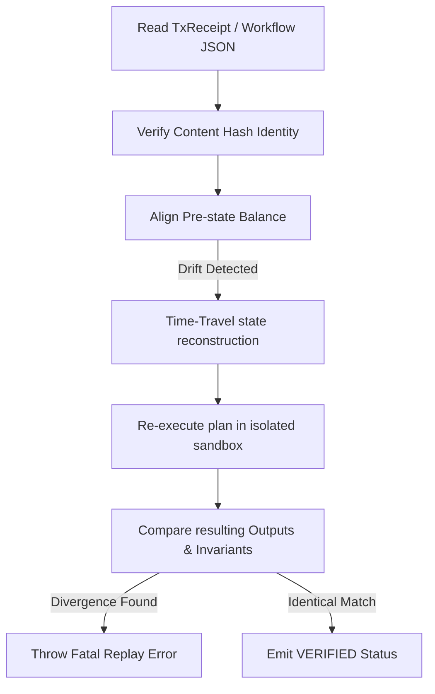

# HardKAS Replay & Verification Specification

Deterministic replay allows developers and automated auditors to verify that a transaction execution sequence can be reproduced bit-for-bit in an isolated sandbox.

---

## 1. The Replay Workflow

When executing `hardkas replay verify <path>`, the runtime executes the following sequence:

1. **Identity Integrity**: Verifies the artifact's `contentHash` using Canonical Stringify v3, ensuring no tampering has occurred since creation.
2. **Causal Pre-state Alignment**: Reads the `preStateHash` in the receipt. If the current virtual DAG state has drifted, the time-travel engine rolls back balances to align the sandbox.
3. **Execution Sandbox**: Re-executes the transaction plan using the canonically sorted input UTXO list.
4. **Divergence Assessment**: Compares the simulated outcomes against the recorded receipt. Any mismatch in fee, mass, inputs, or outputs triggers a fatal rejection.

---

## 2. In-Memory Temporal Reconstruction (Time-Travel)

To verify historic transactions without spinning up isolated nodes from scratch, `@hardkas/localnet` implements `reconstructStateAtDaa`:
* **The Math**: Given a target Daa Score ($D_{target}$), the engine rolls back virtual balances mathematically:
  * Resurrects (marks unspent) UTXOs that were spent *after* $D_{target}$.
  * Prunes (deletes) UTXOs that were created *after* $D_{target}$.
* **The Benefit**: Enables high-speed E2E verification of old transaction branches in milliseconds.

---

## 3. Honest Model Limitations

HardKAS operates under an **Honest Model** of local verification. It explicitly acknowledges what local replay cannot prove:
* **Consensus Validation**: Local execution validates mathematics and policies. It does NOT validate consensus acceptances (which live nodes may reject due to dynamic network rules). Consensus reports are set to `unimplemented`.
* **Bridge Correctness**: Mock bridge executions are simulated via projections, but cross-chain multi-sig security remains outside the cryptographic proof boundary of the local runtime.
