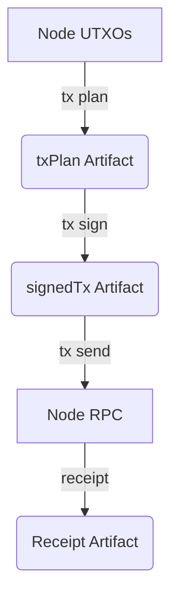

# Transaction Lifecycle

The HardKAS lifecycle is a one-way deterministic state machine.

## Validation at Every Step
- **Plan to Sign**: The signer hashes the `txPlan` and refuses to sign if the schema is invalid.
- **Sign to Send**: The sender checks the cryptographic hash of the `signedTx` against its own `lineage.artifactId`. If they do not match, the payload was tampered with and is aborted.
