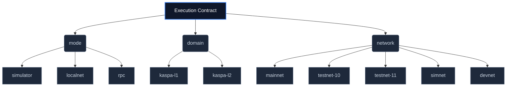

# Execution Worlds

HardKAS 0.12.0-rc.17 introduces the concept of **Execution Worlds** to guarantee deterministic execution and strict isolation between synthetic (simulated) data and real Kaspa networks.

You must never conflate the Simulator with Localnet (Kaspa simnet). They are distinct execution environments with different backends, funding mechanisms, and states.

## Execution Modes Matrix

| Mode      | Backend             | Accounts      | Funding   | UTXOs      | PoW     | Receipts    |
| --------- | ------------------- | ------------- | --------- | ---------- | ------- | ----------- |
| Simulator | JS/in-memory        | synthetic     | synthetic | synthetic  | No      | simulated   |
| Localnet  | rusty-kaspad/Docker | kaspa simnet  | mining    | real local | Yes     | node-backed |
| RPC       | configured node     | network-valid | external  | real       | network | node-backed |

## Invariants
- **Identity Isolation**: A `synthetic` account can only sign transactions for the Simulator. It cannot be used on Localnet.
- **Cross-World Lineage**: An artifact generated in one execution world (e.g. `mode: "localnet"`) cannot be verified, signed, or replayed in a different world (e.g. `mode: "rpc"`). HardKAS enforces strict runtime guards (`assertExecutionCompatibility`) to prevent this.
- **No Implicit State**: You must resolve the `ExecutionTarget` before attempting to interact with the blockchain. Never infer execution mode from an account name or network string.

## The Execution Contract

Every HardKAS artifact that touches the blockchain is bound by an **Execution Contract**. The contract uniquely identifies the context in which the artifact is valid. 
An artifact cannot cross execution boundaries.

When building applications, you interact with the execution contract primarily when verifying receipts. The transaction lifecycle semantics (`submitted -> accepted -> confirmed`) are intrinsically linked to the execution world:

- **Simulator**: Transactions skip `submitted` and immediately emit `confirmed` (in-memory evaluation).
- **Localnet & RPC**: Transactions are `submitted` to the mempool. Developers must use SDK waiters (e.g., `waitForConfirmations`) to poll the Kaspa DAG for `accepted` and `confirmed` states with quantitative evidence (like DAA scores and accepting block hashes).
