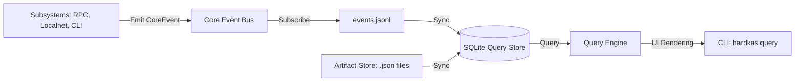

# Operational Query Layer

The Operational Query Layer is the backbone of HardKAS's observability and introspection system. It allows developers to understand *exactly* what happened during a transaction lifecycle, a localnet session, or a replay execution.

## Architecture Overview

The system is designed as a decoupled pipeline:

### 1. Core Event Bus (@hardkas/core)
A lightweight, typed event emitter. It defines the "language" of observability in HardKAS (e.g., `workflow.submitted`, `rpc.error`, `dag.conflict`). Subsystems emit events here without needing to know about persistence or indexing.

### 2. Event Log (events.jsonl)
The `@hardkas/query` layer subscribes to the event bus and appends every event to a deterministic, append-only JSONL file in `.hardkas/events.jsonl`. This ensures we have a permanent record of all operations, even if the indexer is not running.

### 3. Artifact Store
JSON files representing the state transitions of the system (TxPlans, SignedTxs, Receipts, Snapshots). These are stored in `.hardkas/` and form the "evidence" for reasoning.

### 4. Query Store (@hardkas/query-store)
A SQLite-based indexing layer. It scans both the `events.jsonl` and the artifact JSON files to build a relational model. 

**Operational Rules:**
- **Rebuildable Cache**: The SQLite database (`store.db`) is a read-model. It can be safely deleted and recreated using `hardkas query store rebuild`.
- **Atomic Migrations**: Automatically applies schema migrations on startup to ensure data consistency.
- **Deterministic Export**: Supports `hardkas query store export --json` for creating portable, cross-platform state snapshots.
- **Workspace Locking**: Uses a `store.db.lock` to prevent concurrent write access across multiple CLI or SDK instances.

### 5. Query Engine (@hardkas/query)
The orchestrator that provides:
- **Adapters**: Domain-specific logic for DAG, RPC, Replay, and Lineage.
- **Explain Chains**: Rule-based reasoning that explains *why* a certain result was returned (e.g., why a transaction is considered "orphaned").
- **Correlation**: Cross-domain linking to provide a holistic view of a transaction.

## Key Capabilities

### Deterministic Replay Inspection
HardKAS uses a "deterministic-light-model" for DAG state. The query layer can detect if a re-execution (replay) of a transaction diverges from the recorded receipt, classifying the error (e.g., state-transition-divergence, fee-mismatch).

### Causal Lineage
Every artifact is linked to its parent. The query layer can walk these chains back to the root (e.g., the original TxPlan) or forward to the leaf (e.g., the final DAG acceptance), even across different localnet sessions.

### RPC Confidence
By correlating RPC health events with transaction submissions, HardKAS can assess the "risk" of a transaction (e.g., "This transaction was submitted while the node score was 40/100, explaining the long inclusion time").
