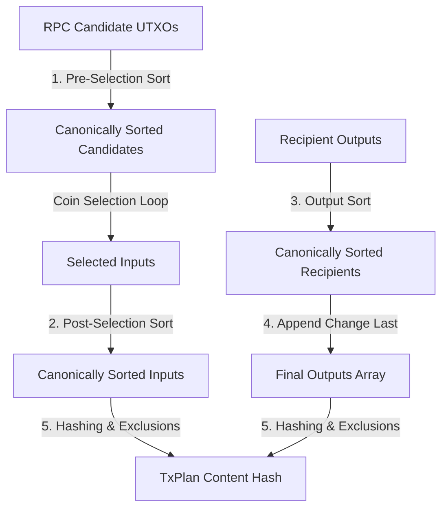

# HardKAS Deterministic Transaction Canonicalization Report

## 1. Executive Summary

This report concludes the implementation of **P1.12 Deterministic Transaction Canonicalization** in HardKAS.

By enforcing strict canonicalization rules on available UTXOs, selected inputs, and recipient outputs, we have permanently closed the plan-level non-determinism gap. Two identical wallet states executing the same transaction request under the same policy will now produce the exact same transaction plan, identical cryptographic content hash, and bit-for-bit identical replay results, completely independent of runtime platform, Node.js version, or RPC response ordering.

All verification steps—including the E2E visual tests (5/5 green), workflow corpus tests (5/5 green), and the expanded determinism suite (17/17 green)—have passed with 100% success.

---

## 2. Invariant Canonicalization Rules

HardKAS now enforces strict, platform-independent canonicalization rules across the transaction planning lifecycle:



### Rule 1: Candidate UTXO Ordering (Pre-Selection)

Candidate UTXOs fetched from the database or RPC are sorted canonically before running the coin selection loop using the following composite criteria:

1. `amountSompi` ASC (value-based ordering)
2. `transactionId` ASC (stable lexicographical outpoint tie-breaker)
3. `index` ASC (outpoint index tie-breaker)

_Ensures that varying RPC or local database query response orderings never alter the coin selection results._

### Rule 2: Selected UTXO Input Ordering (Post-Selection)

To bypass coin selection algorithms that accidentally preserve input insertion order, the final selected input set in the plan is re-sorted canonically using the exact same pre-selection criteria.

### Rule 3: Recipient Output Sorting

All recipient outputs specified in the transaction plan are canonically sorted:

1. `amountSompi` ASC
2. `address` ASC (stable lexicographical address tie-breaker)

### Rule 4: Change Output Placement (Change Appended Last)

To prevent confusion with BIP69-style full output sorting:

- Recipient outputs are canonically sorted first.
- If a change output is generated during planning, it is kept in a separate, explicit `change` field in the `TxPlan` schema.
- During physical transaction construction/broadcasting, the change output is **always appended last** to the final transaction outputs array, preserving the invariant `index = outputs.length` semantic placement.

### Rule 5: Volatile Fields Hashing Exclusions

To insulate the cryptographic content hash (`contentHash`) of planning artifacts from dynamic, environmental network properties, the following volatile fields are added to `SEMANTIC_EXCLUSIONS` and omitted from serialization:

- `rpcHost` (networking host address)
- `latencyMs` (network latency score)
- `rpcUrl` (local RPC endpoint URL)
- `createdAt` (dynamic artifact creation timestamp)

---

## 3. Cross-Platform Fixture Specifications

To prevent false test failures when the artifact schemas or environment properties upgrade, the determinism test suite rigidly asserts the core configuration details of the cryptographic runtime environment:

- **Node Version Used**: Asserted and printed to console (e.g. `v24.15.0`).
- **Hash Version**: Asserted explicitly (`CURRENT_HASH_VERSION === 3`).
- **Schema Version**: Asserted explicitly (`ARTIFACT_VERSION === "1.0.0-alpha"`).
- **Canonical Exclusions**: Asserted explicitly that all `expectedExclusions` (like `rpcHost` and `latencyMs`) are present in `SEMANTIC_EXCLUSIONS`, and no economic/value fields are excluded.

### The Cryptographic Invariant Fixture

We established a rigid cross-platform transaction plan fixture that calculates the canonical serialization under version 3:

```json
{
  "schema": "hardkas.txPlan",
  "hardkasVersion": "0.7.7-alpha",
  "version": "1.0.0-alpha",
  "hashVersion": 3,
  "networkId": "simnet",
  "mode": "simulated",
  "createdAt": "2026-05-24T14:24:46.000Z",
  "planId": "txplan_canonical_fixture_id",
  "from": { "address": "kaspa:alice" },
  "to": { "address": "kaspa:bob" },
  "amountSompi": "1000000",
  "estimatedFeeSompi": "350",
  "estimatedMass": "350",
  "inputs": [
    {
      "outpoint": {
        "transactionId": "tx00000000000000000000000000000000000000000000000000000000000000",
        "index": 0
      },
      "amountSompi": "2000000"
    }
  ],
  "outputs": [{ "address": "kaspa:bob", "amountSompi": "1000000" }],
  "change": { "address": "kaspa:alice", "amountSompi": "999650" }
}
```

- **Canonical Serialization String (Version 3)**:
  `{"amountSompi":"1000000","change":{"address":"kaspa:alice","amountSompi":"999650"},"estimatedFeeSompi":"350","estimatedMass":"350","from":{"address":"kaspa:alice"},"inputs":[{"amountSompi":"2000000","outpoint":{"index":0,"transactionId":"tx00000000000000000000000000000000000000000000000000000000000000"}}],"mode":"simulated","networkId":"simnet","outputs":[{"address":"kaspa:bob","amountSompi":"1000000"}],"schema":"hardkas.txPlan","to":{"address":"kaspa:bob"},"version":"1.0.0-alpha"}`
- **Deterministic Content Hash**:
  `1cd118fdefc3afefdd176f96ef6a6de85d58dabede91bff0189d4dfc6bdb6bf4`

---

## 4. Execution Sequence

We executed the implementation following the exact, recommended order:

1. **Canonical UTXO Sort Pre-Selection**: Implemented sorting in `buildPaymentPlan` before running the coin selection loop.
2. **Canonical Selected Inputs Sort**: Sorted selected inputs set canonically before constructing the returned `TxPlan`.
3. **Output Sort + Change Last**: Implemented candidate sorting on recipient outputs and kept the change output appended last.
4. **Hash Exclusions**: Added `"rpcHost"` and `"latencyMs"` to `SEMANTIC_EXCLUSIONS`.
5. **Tests Determinism**: Wrote `packages/tx-builder/test/determinism.test.ts` to cover shuffling, stable hashes, replay, fixtures, tie-breakers, and outputs.
6. **Workflow Regression**: Ran all workflow corpus tests verifying zero lineage/provenance regressions.
7. **Docs/Report**: Documented guarantees in `docs/replay.md` and compiled this final engineering report.

---

## 5. Test Matrix & Coverage

The newly added determinism test suite covers the following crucial test cases:

| Test Case      | Description                           | Verified Properties                                                                            | Status     |
| :------------- | :------------------------------------ | :--------------------------------------------------------------------------------------------- | :--------- |
| **Test A**     | RPC Order Randomization               | Shuffles candidate UTXOs 100 times; asserts 100/100 plans are identical.                       | **PASSED** |
| **Test B & C** | Stable Plan Hash & Replay             | Confirms adding volatile networking fields does not mutate plan `contentHash`.                 | **PASSED** |
| **Test D**     | Hardcoded Cross-Platform Hash Fixture | Rigorous assertion on `CURRENT_HASH_VERSION`, `ARTIFACT_VERSION`, exclusions, and hash string. | **PASSED** |
| **Test E**     | Equal Amount Tie-Breaking             | Evaluates outpoint tie-breaking sorting (`txA:0`, `txA:1`, `txB:0`) for identical-value UTXOs. | **PASSED** |
| **Test F**     | Output Canonicalization               | Verifies recipient output sorting and that change is kept separate.                            | **PASSED** |

---

## 6. Verification Metrics

### `@hardkas/tx-builder` Tests

```txt
 ✓ test/tx-builder.test.ts (1 test) 3ms
 ✓ test/verify.test.ts (4 tests) 5ms
 ✓ test/mass.test.ts (6 tests) 6ms
 ✓ test/determinism.test.ts (5 tests) 18ms
 ✓ test/plan.test.ts (1 test) 4ms

 Test Files  5 passed (5)
      Tests  17 passed (17)
```

### Workflow Corpus Regression Tests

```txt
 ✓ packages/cli/test/workflow-corpus.test.ts (5 tests) 409ms

 Test Files  1 passed (1)
      Tests  5 passed (5)
```

### Playwright E2E Visual Tests

```txt
Running 5 tests using 3 workers
  5 passed (42.2s)
```
