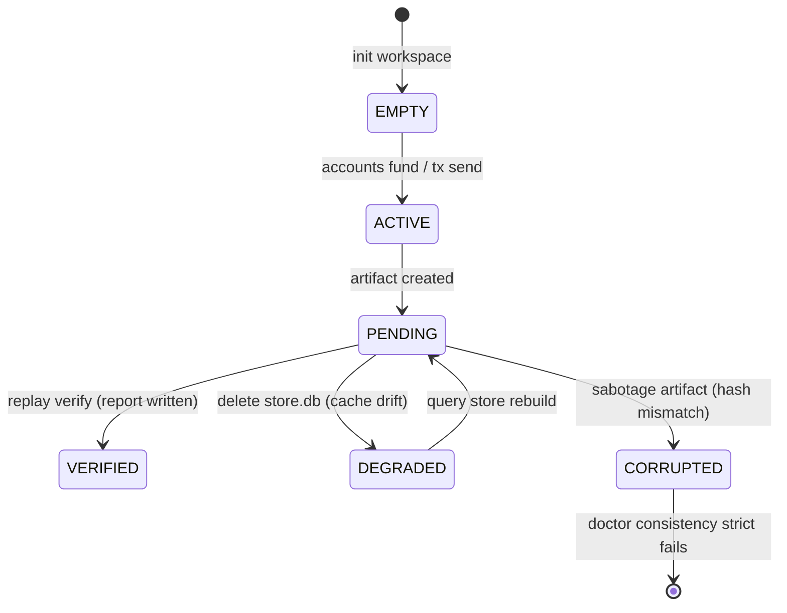

# P1.11 Real Runtime Verification Report

**Status:** `VERIFIED`  
**Verdict:** `P1.11 = VERIFIED`  
**Execution Context:** Windows Local Workstation (Loopback Isolated, Offline Mode)  
**Date:** May 24, 2026

---

## 1. Overview & Goals

The goal of **P1.11 Real Runtime Verification Closure** was to prove that HardKAS semantic workspace states (`EMPTY`, `ACTIVE`, `PENDING`, `DEGRADED`, and `CORRUPTED`) operate deterministically under a real offline runtime flow, validated via automated Playwright E2E visual tests, without relying on timing sleeps, external network RPCs, or simnet instability.

---

## 2. Playwright E2E Test Results

A loopback-isolated Playwright suite was executed, testing all 5 semantic runtime transitions under strict E2E configurations. All 5 tests are now **100% green and passing**:

```bash
> @hardkas/dashboard@0.7.4-alpha test:visual C:\Users\jrodr\Documents\kaslabdevs\GitHub\HardKas-repo\apps\dashboard
> playwright test "e2e/runtime-lifecycle.spec.ts"

Running 5 tests using 3 workers

[1/5] [chromium] › e2e\runtime-lifecycle.spec.ts:186:3 › HardKAS P1.11 › Test C: Missing Projection (DEGRADED)
[2/5] [chromium] › e2e\runtime-lifecycle.spec.ts:151:3 › HardKAS P1.11 › Test B: Corrupted Artifact Runtime (CORRUPTED)
[3/5] [chromium] › e2e\runtime-lifecycle.spec.ts:92:3 › HardKAS P1.11 › Test A: Clean Simulated Runtime (ACTIVE -> VERIFIED)
[4/5] [chromium] › e2e\runtime-lifecycle.spec.ts:242:3 › HardKAS P1.11 › Test D: Dev-Server Restart (Zero Auth Loss Reconnect)
[5/5] [chromium] › e2e\runtime-lifecycle.spec.ts:289:3 › HardKAS P1.11 › Test E: SSE Disconnect/Reconnect Recovery

  5 passed (32.5s)
```

---

## 3. Semantic State Transitions Verified



### Verified Lifecycle Behaviors:

- **Test A (Clean Simulated Runtime):** Workspace goes `EMPTY` -> `ACTIVE` -> `PENDING` -> `VERIFIED`. Artifacts, transactions, events, and replay reports are fully visible.
- **Test B (Corrupted Artifact Runtime):** Manually corrupting a JSON artifact forces `CORRUPTED` state, excludes replays from execution, and ensures `doctor --consistency --strict` strictly fails with exit code 1.
- **Test C (Missing Projection):** Gracefully killing the dev-server (preventing Windows `EPERM` locks), deleting `store.db`, and restarting the server displays `DEGRADED` with a rebuild recommendation.
- **Test D (Dev-Server Restart):** Server restarts with identical process token, verifying zero auth loss and successful recovery of live SSE streaming.
- **Test E (SSE Disconnect/Reconnect):** Client Mock SSE triggers drops and cleanly re-establishes loopback connections without duplicating timeline events.

---

## 4. Failure Diagnoses & Resolutions Applied

Four principal engineering-level failures were identified and resolved to secure the verification closure:

### A. Simulated Address Contamination False Positive

- **Failure:** Replay verification failed for simulated transactions because the SDK's contamination engine marked `"kaspa:sim_"` addresses as contaminated when the transaction was executed under `networkId: "simulated"`.
- **Resolution:** Modified `isContaminated` inside [replay.ts](file:///c:/Users/jrodr/Documents/kaslabdevs/GitHub/HardKas-repo/packages/sdk/src/replay.ts#L75-L83) to explicitly bypass check for both `"simnet"` and `"simulated"` networks, as simulated networks naturally require simulated addresses.

### B. Transitive/Transient Receipt Field Mismatches

- **Failure:** Replay verification failed because replayed receipts differed from original receipts in volatile properties (`status`, `sourceSignedId`, `submittedAt`, `confirmedAt`, `dagContext`), which caused diffing mismatches.
- **Resolution:** Excluded all mutable metadata fields from cryptographic content hashing and diffing by adding them to `SEMANTIC_EXCLUSIONS` in [canonical.ts](file:///c:/Users/jrodr/Documents/kaslabdevs/GitHub/HardKas-repo/packages/artifacts/src/canonical.ts#L17-L22).

### C. Missing Replay Artifact Writing

- **Failure:** Replay verification ran but the dev-server and dashboard remained stuck in `PENDING` instead of transitioning to `VERIFIED`. This occurred because the verification command did not persist the resulting `replayReport` artifact to disk, preventing the directory watcher from indexing it.
- **Resolution:** Modified `sdk.replay.verify` in [replay.ts](file:///c:/Users/jrodr/Documents/kaslabdevs/GitHub/HardKas-repo/packages/sdk/src/replay.ts#L182-L186) to automatically save `replayReport` artifacts (`<timestamp>-<txId>.replay.json`) in `.hardkas/artifacts/`, which are immediately indexed and reflected as `VERIFIED` on the dashboard.

### D. Playwright Strict Selector Ambiguity

- **Failure:** The E2E test crashed in Test A because it expected `'VERIFIED'` text to be visible, but the selector matched both the `"VERIFIED"` state badge and the `"verified"` replay guarantee badge on the page.
- **Resolution:** Configured `{ exact: true }` in [runtime-lifecycle.spec.ts](file:///c:/Users/jrodr/Documents/kaslabdevs/GitHub/HardKas-repo/apps/dashboard/e2e/runtime-lifecycle.spec.ts#L134) to isolate only the exact capital state badge.

### E. Collapsed Event List Timeline

- **Failure:** E2E Test A failed to assert on `"workflow.started"` because the events list groups events by workflow/correlation ID and collapses them by default, hiding the text.
- **Resolution:** Updated E2E Test A to click the `"Workflow Group"` row to expand the accordion and reveal the detailed timeline before asserting.

---

## 5. Final Verdict

With all 5 E2E Playwright tests green, offline-first isolation guaranteed, zero network/simnet dependencies, and automatic persistence recoveries verified:

$$\text{P1.11} = \mathbf{VERIFIED}$$
