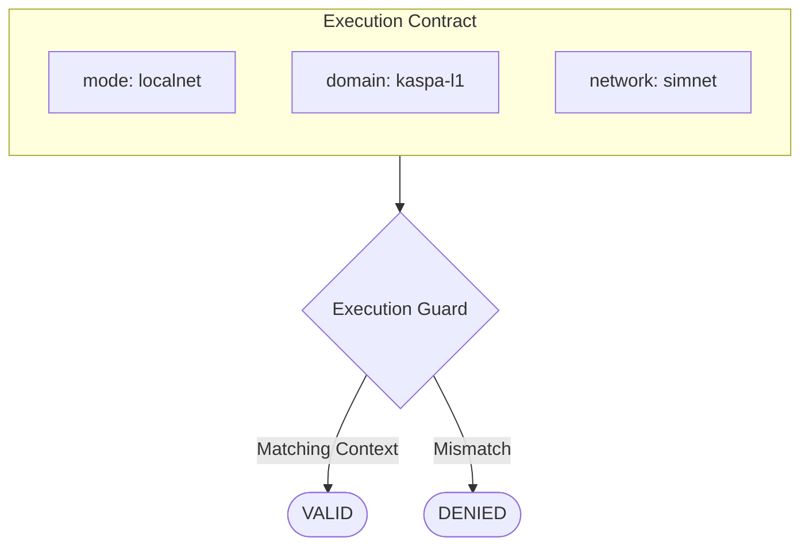
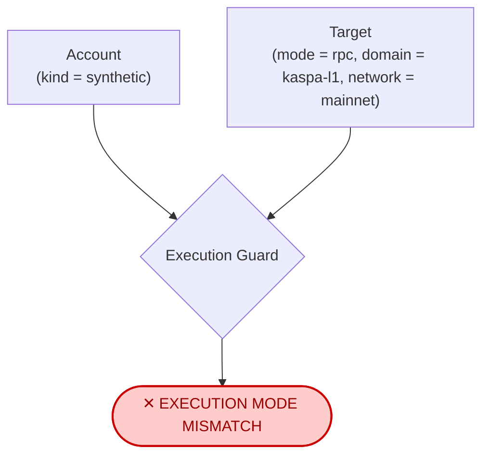

# Execution Contract Specification

## Definition

An **Execution Contract** is the explicit identity of the environment in which a HardKAS workflow is intended to operate. It is represented by an `ExecutionTarget` and strictly enforced by the **Execution Guard**. 

HardKAS enforces execution compatibility at runtime and preserves execution identity across artifacts.

## Normative Levels

This specification uses three normative levels to distinguish between current runtime enforcement and proposed architectural directions:

*   **MUST**: Behavior strictly enforced by current code (Execution Guard).
*   **SHOULD**: Recommended public/API semantics and builder practices.
*   **FUTURE**: Proposed behavior or schema changes not currently implemented.

## Schema Structure

The Execution Contract is defined by three distinct properties.

```typescript
type ExecutionTarget = {
  mode: "simulator" | "localnet" | "rpc" | "l2-rpc";
  domain: "kaspa-l1" | "evm-l2";
  network: string; // e.g. "simnet", "testnet-11", "mainnet"
};
```

### The Three Questions

Every execution target answers three fundamental questions:

1.  **`mode`**: *How is it being executed?* (Synthetic coherence, local Docker node, or remote RPC).
2.  **`domain`**: *Which execution domain owns the semantics?* (Kaspa UTXO model vs EVM L2 model).
3.  **`network`**: *Which network state is being targeted?* (simnet, mainnet, etc.).

## Visual Representation

### 1. Happy Path: Valid Execution Contract

When a workflow matches the expected execution boundaries, the Execution Guard allows it to pass.

**ASCII Flow:**
```text
Execution Contract
┌─────────────────────────────────────┐
│ mode       localnet                 │
│ domain     kaspa-l1                 │
│ network    simnet                   │
└─────────────────────────────────────┘
                    │
                    ▼
            Execution Guard
                    │
          ┌─────────┴─────────┐
          ▼                   ▼
       VALID                DENIED
```

**Mermaid Diagram:**


### 2. Failure Path: Mode Mismatch

A synthetic account attempt against a real node (or vice versa) results in an immediate rejection by the Guard.

**ASCII Flow:**
```text
Account
kind = synthetic

Target
mode = rpc
domain = kaspa-l1
network = mainnet

                    │
                    ▼
         EXECUTION MODE MISMATCH
                    ✕
```

**Mermaid Diagram:**


## Normative Rules

### 1. Domain Isolation
*   **MUST**: The Execution Guard MUST unconditionally isolate domains. If `target.domain === "evm-l2"`, Kaspa accounts MUST fail with `ExecutionDomainMismatchError`.

### 2. Mode and Account Isolation
*   **MUST**: If `target.mode === "simulator"`, the account `kind` MUST be `"synthetic"`.
*   **MUST**: If `target.mode === "localnet"` or `"rpc"`, the workflow MUST NOT use a synthetic account. The account MUST be compatible with the Kaspa-L1 execution domain.

### 3. Artifact compatibility
*   **SHOULD**: Artifacts (TxPlan, SignedTx, TxReceipt) SHOULD preserve execution identity and the fields required by their schema.
